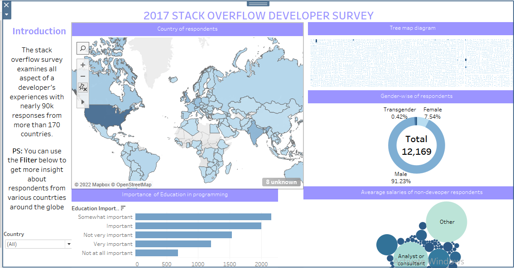

# Stack-Overflow-2017-Developer-Survey-Data-Analysis
# A data  analysis Project using Python and Tableau. [Click here](#) for the full article.
The stack overflow survey is an annual survey that examines all aspects of a developers’ experience such as favorite technologies, work preferences, career satisfaction and education background. With nearly 60K responses from more than 170 countries. The analysis was carried out using python and python libraries such as NumPy and pandas to get the desired data by doing altercation and manipulation on the data, GEOPY for location geocoding, seaborn and matplotlib for visualization and also made uses of other built in library as shown in my Jupiter Notebook. 

In the Jupyter Notebook, you will leearn how I carried out the following steps for the project:
  1. Import library
  2. Import data set
  3. Data cleaning
  4. Data exploration
  5. Model development

# Tableau dashboard visualization

[Click here](#) to view dashboard

# REMARK
Some of the insights I generated are stated below:   
    * Based on the demographics of the survey respondents, we can infer that the survey is somewhat representative of          the overall programming community, although it definitely has fewer responses from programmers who are women &          non-binary genders
    * Most programmers hold a college degree, although a fairly large percentage did not have computer science as their        major in college, so a computer science degree isn’t compulsory for learning to code or building a career in            programming.
    * JavaScript, C#, Java and SQL were the most used languages by professional developer, followed by python in 2017.
    * The average salaries range is between ~150K to ~180K. Most popular languages as JavaScript, C#, Java, SQL and            Python we found in the first question seem to be in the middle of the range, and that’s expected! because the            more people who knows that language mean less rareness.
    *  From the model analysis of Salary prediction from the given numerical data in the 2017 dataset , it was shown            that CareerSatisfaction has the highest correlation fit with salary and multiple linear regression model is the          best fit to predict salary of developers from the given data.

    

    
